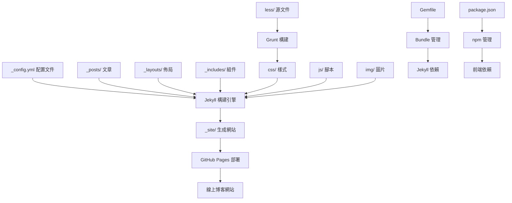

# Yuan's Blog 項目結構說明

## 📁 項目架構圖

```
DDChen666.github.io/
├── 📄 _config.yml              # 主配置文件 (網站設置、社交媒體、側邊欄等)
├── 📄 index.html               # 首頁模板
├── 📄 about.html               # 關於頁面
├── 📄 archive.html             # 歸檔頁面
├── 📄 projects.html            # 項目展示頁面
├── 📄 learning.html            # 學習記錄頁面
├── 📄 tools.html               # 工具推薦頁面
├── 📄 404.html                 # 404錯誤頁面
├── 📄 offline.html             # PWA離線頁面
├── 📄 search.json              # 搜索數據
├── 📄 feed.xml                 # RSS訂閱
├── 📄 sw.js                    # Service Worker (PWA功能)
├── 📄 Gemfile                  # Ruby依賴管理
├── 📄 package.json             # Node.js依賴管理
├── 📄 Gruntfile.js             # 前端構建工具配置
├── 📄 Rakefile                 # Ruby任務腳本
│
├── 📂 _posts/                  # 📝 博客文章目錄
│   ├── 📄 2024-01-01-blog-template-demo.markdown
│   └── 📂 _posts_backup/       # 隱藏的原文章備份
│
├── 📂 _layouts/                # 🎨 頁面佈局模板
│   ├── 📄 default.html         # 基礎佈局
│   ├── 📄 page.html            # 頁面佈局
│   ├── 📄 post.html            # 文章佈局
│   └── 📄 keynote.html         # 演示文稿佈局
│
├── 📂 _includes/               # 🧩 可重用組件
│   ├── 📄 head.html            # HTML頭部
│   ├── 📄 nav.html             # 導航欄
│   ├── 📄 footer.html          # 頁腳
│   ├── 📄 intro-header.html    # 頁面頭部
│   ├── 📄 short-about.html     # 側邊欄簡介
│   ├── 📄 featured-tags.html   # 特色標籤
│   ├── 📄 friends.html         # 友情鏈接
│   ├── 📄 sns-links.html       # 社交媒體鏈接
│   ├── 📄 search.html          # 搜索功能
│   └── 📂 about/               # 關於頁面內容
│       ├── 📄 zh.md            # 中文版關於
│       └── 📄 en.md            # 英文版關於
│
├── 📂 css/                     # 🎨 樣式文件
│   ├── 📄 bootstrap.min.css    # Bootstrap框架
│   ├── 📄 hux-blog.min.css     # 主題樣式
│   └── 📄 hux-blog.css         # 未壓縮樣式
│
├── 📂 less/                    # 🎨 LESS源文件
│   ├── 📄 hux-blog.less        # 主樣式文件
│   ├── 📄 variables.less       # 變量定義
│   ├── 📄 mixins.less          # 混合函數
│   ├── 📄 sidebar.less         # 側邊欄樣式
│   ├── 📄 highlight.less       # 代碼高亮
│   └── 📄 search.less          # 搜索樣式
│
├── 📂 js/                      # ⚡ JavaScript文件
│   ├── 📄 jquery.min.js        # jQuery庫
│   ├── 📄 bootstrap.min.js     # Bootstrap JS
│   ├── 📄 hux-blog.min.js      # 主題腳本
│   ├── 📄 simple-jekyll-search.min.js # 搜索功能
│   ├── 📄 sw-registration.js   # Service Worker註冊
│   └── 📄 archive.js           # 歸檔頁面腳本
│
├── 📂 img/                     # 🖼️ 圖片資源
│   ├── 📄 favicon.ico          # 網站圖標
│   ├── 📄 avatar-yuan-home.jpg # 頭像圖片
│   ├── 📄 home-bg.jpg          # 首頁背景
│   ├── 📄 404-bg.jpg           # 404頁面背景
│   └── 📄 post-bg-*.jpg        # 文章背景圖片
│
├── 📂 pwa/                     # 📱 PWA相關文件
│   ├── 📄 manifest.json        # Web App清單
│   └── 📂 icons/               # PWA圖標
│       ├── 📄 128.png
│       ├── 📄 512.png
│       └── 📄 icon.svg
│
├── 📂 fonts/                   # 🔤 字體文件
│   └── 📄 glyphicons-*         # Bootstrap圖標字體
│
└── 📂 _doc/                    # 📚 文檔目錄
    ├── 📄 Manual.md            # 用戶手冊
    └── 📄 README.zh.md         # 中文說明
```

## 🔄 文件關係流程圖



## 🎯 核心組件說明

### 1. 配置層 (Configuration)
- **`_config.yml`**: 網站核心配置，包含標題、描述、社交媒體、側邊欄設置等
- **`Gemfile`**: Ruby依賴管理，定義Jekyll和插件版本
- **`package.json`**: Node.js依賴，主要用於前端構建工具

### 2. 內容層 (Content)
- **`_posts/`**: Markdown格式的博客文章，文件名格式：`YYYY-MM-DD-title.markdown`
- **`about.html`**: 關於頁面，支持中英文雙語
- **`projects.html`**: 項目展示頁面
- **`learning.html`**: 學習記錄頁面
- **`tools.html`**: 工具推薦頁面

### 3. 模板層 (Templates)
- **`_layouts/`**: 頁面佈局模板，使用Liquid模板語言
  - `default.html`: 基礎佈局，包含HTML結構
  - `page.html`: 普通頁面佈局
  - `post.html`: 文章頁面佈局
- **`_includes/`**: 可重用組件，被其他模板引用

### 4. 樣式層 (Styles)
- **`less/`**: LESS源文件，開發時編輯
- **`css/`**: 編譯後的CSS文件，實際使用
- **`Gruntfile.js`**: 自動化構建，將LESS編譯為CSS

### 5. 腳本層 (Scripts)
- **`js/`**: JavaScript文件，包含jQuery、Bootstrap和自定義腳本
- **`sw.js`**: Service Worker，提供PWA功能

### 6. 資源層 (Assets)
- **`img/`**: 圖片資源，包含背景圖、頭像、圖標等
- **`fonts/`**: 字體文件
- **`pwa/`**: PWA相關資源

## 🚀 構建流程

1. **開發階段**: 編輯LESS文件和Markdown文章
2. **構建階段**: Grunt編譯LESS為CSS，Jekyll處理模板和內容
3. **生成階段**: Jekyll生成靜態HTML文件到`_site/`目錄
4. **部署階段**: GitHub Pages自動部署`_site/`內容

## 📝 內容管理

- **文章管理**: 在`_posts/`目錄創建Markdown文件
- **頁面管理**: 直接編輯HTML文件或在`_includes/`中修改組件
- **樣式管理**: 編輯`less/`中的LESS文件，通過Grunt編譯
- **配置管理**: 修改`_config.yml`進行網站設置